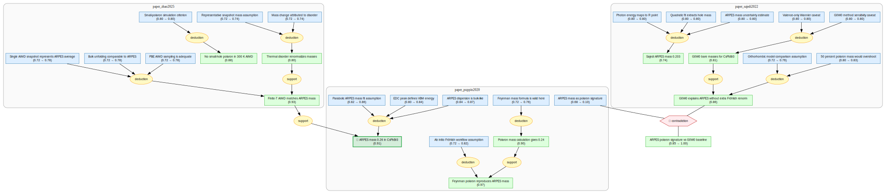

# Perovskite ARPES Polaron Gaia




This document is a compact narrative view of the rendered Gaia graph. It follows
the graph's real open question, defined by its accepted contradiction:

> Can ARPES effective-mass enhancement itself be treated as a valid polaronic
> mass-dressing signature, or is it already explainable by a G0W0 quasiparticle
> baseline without additional Fröhlich-polaron renormalization?

## 1. Accepted Open Question

The graph contains one contradiction operator:

> **ARPES mass as polaron signature**
>
> vs.
>
> **G0W0 explains ARPES mass without extra Fröhlich renormalization**

The first side says that, in CsPbBr3, ARPES effective-mass enhancement remains a
valid signature of electron-phonon polaronic mass dressing even when phonon
replica peaks are not resolved.

This side is currently represented by a clear LKM source claim with Puppin2020
provenance, but not by a chain-backed LKM evidence factor. The graph therefore
treats the contradiction warrant conservatively.

The second side says that the measured ARPES mass can be accounted for by a
G0W0 quasiparticle baseline and therefore does not require extra
Fröhlich-polaron mass renormalization.

This is the graph's true open question: what observable or matched theoretical
baseline makes ARPES mass a decisive polaron signature rather than a quantity
already explained by quasiparticle and finite-temperature baselines?

The contradiction is mechanistic, not simply numerical: the graph does not
treat the Puppin and Sajedi ARPES masses as the same measurement, nor does it
define the conflict by their numerical difference alone.

## 2. Observable Anchor

The central measurement is:

> **ARPES mass 0.26 in CsPbBr3**

It is supported by three experimental premises:

- **Parabolic ARPES mass fit assumption**: the valence-band dispersion near the
  VBM is fit by a local parabolic form.
- **EDC peak defines VBM energy**: the EDC peak maximum is used to set the VBM
  energy reference for mass extraction.
- **ARPES dispersion is bulk-like**: photon/polarization-dependent ARPES and
  unfolding arguments support treating the observed dispersion as bulk-like.

These premises lead by deduction to the ARPES benchmark
`m_exp = 0.26 +/- 0.02 m_e`. The graph treats this as the observable to explain,
not as a mechanism by itself.

## 3. Polaron-Signature Side

The polaron branch argues that the ARPES mass is explained by large-polaron
dressing:

- **Ab initio Fröhlich workflow assumption** defines the workflow: compute
  phonons, Born charges, dielectric response, Fröhlich coupling, and then use a
  Feynman-polaron treatment.
- **Feynman polaron reproduces ARPES mass** states that this workflow reproduces
  the ARPES mass when the Fröhlich mechanism dominates.
- **Feynman mass formula is valid here** supplies the weak/intermediate-coupling
  mass formula used in the calculation.
- **Polaron mass calculation gives 0.24** gives the atomic numerical result:
  with `m_bare = 0.17 m_e` and `alpha = 1.81`, where `m_e` is the
  free-electron mass, the renormalized mass is about `0.24 m_e`, at the lower
  edge of the `0.26 +/- 0.02 m_e` ARPES interval and therefore numerically
  compatible within the quoted uncertainty.
- **ARPES mass as polaron signature** turns the numerical match into an
  interpretive claim: fitted ARPES mass enhancement is a valid polaronic
  mass-dressing signature even without resolved phonon replicas.

This side therefore reads the ARPES mass as positive evidence for a large
Fröhlich polaron.

## 4. Finite-Temperature Baseline Side

The finite-temperature branch argues that thermal lattice disorder can reproduce
the same ARPES-scale mass without using carrier self-localization as the
interpretation of that mass:

- **Finite-T AIMD matches ARPES mass** states that a 300 K AIMD/HSE-SOC
  calculation gives a hole mass near `0.265 m_e`, matching the ARPES-scale mass
  without introducing an extra hole in that calculation.
- **Representative finite-T snapshot assumption** is the assumption that the
  chosen AIMD thermal structure captures the mass-renormalizing lattice-disorder
  effect relevant to the ARPES-scale curvature.
- **Bulk unfolding comparable to ARPES** is the assumption that unfolded bulk
  HSE-SOC bands can be compared to ARPES without explicit corrections for
  surface, matrix-element, or probing-depth effects.
- **PBE AIMD sampling is adequate** is the assumption that the AIMD structural
  ensemble is accurate enough for subsequent HSE-SOC mass extraction.
- **Thermal disorder renormalizes masses** quantifies the effect: going from
  ideal 0 K to 300 K thermal structure changes the hole mass from about
  `0.149 m_e` to `0.265 m_e`.
- **Representative snapshot mass assumption** and **Mass change attributed to
  disorder** are the premises that let this finite-temperature mass shift be
  interpreted as a structural-disorder effect.
- **No small-hole polaron in 300 K AIMD** says that adding a hole in the 300 K
  calculation does not produce localized in-gap states or a strong valence-band
  perturbation.
- **Small-polaron simulation criterion** defines what would count as a small
  polaron in that simulation.

This branch does not directly resolve the accepted contradiction, but it
weakens the uniqueness of the polaron-signature interpretation by showing that
the ARPES-scale mass is reachable from a finite-temperature structural baseline
without invoking additional carrier-induced polaron mass renormalization. Its
explicit injected-hole test is specifically evidence against localized
small-hole-polaron behavior in that simulation, not a universal proof that all
large-polaron physics is absent.

## 5. G0W0 Counter-Side

The G0W0 branch supplies the direct counter-side of the accepted contradiction:

- **Sajedi ARPES mass 0.203** reports an independent room-temperature ARPES mass
  near `0.203 +/- 0.016 m_e`.
- **Photon energy maps to R point**, **Quadratic fit extracts hole mass**, and
  **ARPES mass uncertainty estimate** are the experimental premises supporting
  that re-measured ARPES value.
- **G0W0 bare masses for CsPbBr3** gives a quasiparticle baseline: orthorhombic
  G0W0 with spin-orbit coupling yields a hole mass near `0.226 m_e`.
- **Valence-only Wannier caveat** and **G0W0 method sensitivity caveat** record
  the main computational caveats for that baseline.
- **50 percent polaron mass would overshoot** says that applying a large
  Fröhlich-polaron mass enhancement to the G0W0 baseline would overshoot the
  measured ARPES mass.
- **Orthorhombic model comparison assumption** records the structural/phase
  comparability assumption behind the G0W0-to-ARPES comparison.
- **G0W0 explains ARPES mass without extra Fröhlich renormalization** is the
  branch conclusion: the ARPES mass can be explained without invoking
  additional Fröhlich-polaron renormalization.

This is the direct opponent of the polaron-signature claim.

## 6. Inference State

The rendered graph contains:

- 29 rendered science knowledge nodes.
- 14 strategy nodes.
- 1 contradiction operator.
- 19 independent premises with priors.
- 36 inferred beliefs.

The starmap filters out Gaia's internal `__conjunction_result_*` and
`__implication_result_*` helper nodes, so the visual graph is the complete
science-readable probability graph rather than a dump of lowering internals.

The accepted contradiction has a conservative high warrant. Belief propagation
therefore registers a real tension between the ARPES-as-polaron-signature claim
and the G0W0 no-extra-polaron interpretation, while preserving the measurement
anchor and both explanatory branches.

## 7. Graph-Level Meaning

The graph does not say "polaron is true" or "polaron is false." It says:

> ARPES mass is a strong benchmark, but its interpretation is not self-evident.

The decisive question is whether ARPES mass enhancement can stand alone as a
polaronic signature, or whether it only becomes meaningful after comparing
against finite-temperature structural disorder and G0W0 quasiparticle baselines.

This is an evidential-status conflict, not a direct claim that the two ARPES
mass numbers are the same experiment or that their numerical difference alone
constitutes the contradiction.

## Package Contents

- `src/perovskite_arpes_polaron/` — Gaia DSL claims, deductions, supports, contradiction, and priors.
- `references.json` — bibliographic references used by the package.
- `artifacts/lkm-discovery/` — raw LKM payloads, retrieval timeline, graph growth log, and mapping audits.
- `.gaia/` — compiled Gaia artifacts, beliefs, inquiry state, and starmap outputs.

## Quality Gates

The package currently passes:

```bash
gaia compile .
gaia check --brief .
gaia check --hole .
gaia infer .
gaia inquiry review --strict .
```

Current compiled state: 50 knowledge nodes, 14 strategies, and 1 contradiction operator.
